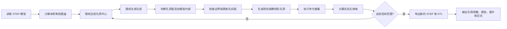

# 随机多孔 STEP 模型生成器

> **本目录是“边界开孔 + 全孔连通”变体。** 与原项目相比仅改变两条约束：
> 孔中心在实体内或边界上即可，孔体允许接触或穿过模型外表面；第一个孔之后的
> 每个孔必须与已有孔簇有效重叠，最终导出前还会验证所有成功孔属于同一连通网络。
> 因此本变体要求 `allow_overlap: true`，`boundary_clearance` 参数仅为兼容原配置而保留。

## 1. 项目简介

这个项目用于把一个已有的封闭 STEP 实体（例如骨头、植入物、立方体或圆柱体）转换成内部带随机球形孔或椭球形孔的多孔实体。

用户只需要准备一个 STEP 文件并修改 `config.yaml`，程序会自动完成孔洞采样、几何安全检查、布尔差集、孔隙率计算和结果导出。第一版采用“随机孔洞布尔减去法”，不包含 Voronoi 或骨小梁生成。

- 输入：一个封闭、可计算体积的 STEP 实体，默认是 `input/bone.step`。
- 主要输出：多孔 STEP、多孔 STL、孔洞参数 CSV、孔隙率 JSON、孔径分布 PNG 和日志。
- 推荐用途：参数试验、简单随机多孔结构、Abaqus/HyperMesh/Gmsh 前处理之前的几何生成。

## 2. 工作原理

程序不是在 STEP 表面“画圆”，而是在模型内部创建真实的三维球体或椭球体，再用 OCC 布尔差集从原实体中减去这些工具体。



实际孔隙率使用真实几何体积计算：

```text
actual_porosity = (original_volume - porous_volume) / original_volume
```

因此孔洞相互重叠时，重叠部分不会被重复计算。

## 3. 文件结构

```text
porous_step_model/
├─ input/                         输入 STEP 文件
│  └─ bone.step                   默认骨模型
├─ output/                        所有运行结果
├─ src/
│  ├─ create_porous_model.py      主程序和完整流程
│  ├─ geometry_utils.py           STEP、孔洞和布尔几何函数
│  └─ porosity_utils.py           孔隙率、CSV、JSON、PNG、STL 检查
├─ tests/
│  └─ make_cube_step.py           测试立方体生成器
├─ config.yaml                    用户主要修改的配置
├─ config.cube100.yaml            已验证的 100 mm 立方体示例配置
├─ requirements.txt               Python 依赖列表
├─ beginner_guide.md              完全按步骤编写的新手手册
├─ code_map.md                    代码功能地图
└─ README.md                      项目总体说明
```

| 文件或目录 | 作用 | 用户是否需要修改 | 修改注意事项 |
|---|---|---|---|
| `input/` | 存放原始 STEP | 需要放入文件 | 不要覆盖唯一的原始备份 |
| `output/` | 保存所有生成结果 | 不需要手工修改 | 同名文件会被下次运行覆盖 |
| `src/create_porous_model.py` | 主流程、参数读取、随机循环和导出 | 一般不改 | 修改可能改变整个算法 |
| `src/geometry_utils.py` | 几何判断、孔实体和布尔差集 | 一般不改 | OCC 布尔代码应谨慎修改 |
| `src/porosity_utils.py` | 孔隙率、CSV、JSON、图片和 STL 检查 | 一般不改 | 孔隙率公式不建议修改 |
| `tests/make_cube_step.py` | 生成简单测试立方体 | 通常不改 | 用命令参数改变边长即可 |
| `config.yaml` | 控制输入、孔径、孔隙率、孔数等 | 主要修改 | YAML 缩进必须保留 |
| `requirements.txt` | 声明需要安装的库 | 不需要 | 不熟悉依赖时不要删版本条件 |
| `README.md` | 总体说明和参数手册 | 不需要 | 可自行补充实验记录 |
| `beginner_guide.md` | 新手逐步操作 | 不需要 | 按顺序执行即可 |
| `code_map.md` | 功能与函数对应关系 | 不需要 | 用于查找代码，不影响运行 |

## 4. 安装软件

### 4.1 安装 Python

推荐 Python 3.10 或 3.11。Windows 用户可从 Python 官网安装，安装界面务必勾选 `Add Python to PATH`。安装后打开 PowerShell：

```powershell
python --version
pip --version
```

如果显示版本号，说明安装成功。CadQuery 在某些 Windows 环境中用 Conda 更稳：

```powershell
conda create -n porous-cad python=3.11 -y
conda activate porous-cad
```

### 4.2 安装项目依赖

```powershell
cd D:\MX\porous_step_model
pip install -r requirements.txt
```

依赖作用：CadQuery/OCC 负责 STEP 与布尔，NumPy 负责随机数，Pandas 负责 CSV，PyYAML 读取配置，Matplotlib 绘图，Trimesh 清理和检查 STL。

## 5. 运行真实骨模型

1. 备份原始 STEP。
2. 将模型复制到 `input/` 并命名为 `bone.step`。
3. 确认 STEP 是封闭实体而不是只有表面的壳。
4. 修改 `config.yaml`。
5. 运行：

```powershell
cd D:\MX\porous_step_model
python src/create_porous_model.py --config config.yaml
```

相对路径以配置文件所在目录为基准，所以也可使用配置文件绝对路径。

## 6. config.yaml 参数说明

所有长度参数的单位都与 STEP 一致。程序无法从 STEP 文件可靠推断“这是 mm 还是 m”，用户必须确认模型单位。

| 参数名 | 含义与控制内容 | 推荐初始值 | 增大效果 | 减小效果 | 注意事项 |
|---|---|---:|---|---|---|
| `input_step` | 输入 STEP 路径 | `input/bone.step` | 不适用 | 不适用 | 路径或文件名必须存在 |
| `output_step` | 输出 STEP 路径 | `output/bone_porous.step` | 不适用 | 不适用 | 同名文件会覆盖 |
| `output_stl` | 输出 STL 路径 | `output/bone_porous.stl` | 不适用 | 不适用 | 同名文件会覆盖 |
| `random_seed` | 随机种子，无单位 | `42` | 换一套随机孔位 | 换一套随机孔位 | 不控制孔大小；相同值便于复现 |
| `target_porosity` | 目标孔隙率，0～1 | 真实骨首次 `0.05` | 删除体积和孔数增多 | 模型更致密、更稳 | `0.40` 表示 40%，不是 0.40% |
| `porosity_tolerance` | 允许孔隙率误差，无单位 | `0.01`～`0.02` | 更早停止、精度较低 | 更接近目标、可能更慢 | 批量切割会产生少量过冲 |
| `min_pore_diameter` | 最小基础孔径 | 依模型尺寸决定 | 平均孔变大、孔数可能减少 | 小孔增多、布尔和网格更难 | 必须大于 0 |
| `max_pore_diameter` | 最大基础孔径 | 约局部薄壁尺寸的 20% 以下 | 更快提高孔隙率，薄壁风险增加 | 更均匀但需更多孔 | 不得小于最小孔径 |
| `pore_diameter_distribution` | 孔径分布类型 | `uniform` | 不适用 | 不适用 | 第一版只能写 `uniform` |
| `max_pore_count` | 最多接受多少个孔，无单位 | `300`～`500` 起步 | 更可能达到高孔隙率，速度变慢 | 更快，但可能达不到目标 | 达到上限会停止并 warning |
| `max_sampling_attempts` | 最多尝试多少个随机候选点 | `100000` | 复杂模型更可能找到孔位 | 更早停止 | 不是实际孔数；大量候选会被拒绝 |
| `allow_overlap` | 是否允许孔洞相交 | 首次 `false` | `true` 可提高连通性和填充率 | `false` 几何通常更稳 | YAML 布尔值不要加引号 |
| `overlap_factor` | 允许接近/重叠程度，0～1 | `0.10` 起步 | 孔中心可更近，连通性增加 | 孔间距增大 | 仅重叠开启时有效；过大易产生无效 STEP |
| `boundary_clearance` | 孔外缘到外表面的额外安全距离 | 最大孔半径的 20%～50% | 外壁更厚、更安全，但孔位减少 | 更容易达到目标，薄壁风险增加 | 避免设为负数；0 表示无额外安全距离 |
| `hole_shape` | 孔形状 | `sphere` | 不适用 | 不适用 | 只能写 `sphere` 或 `ellipsoid` |
| `ellipsoid_scale_range.x/y/z` | 椭球三方向缩放范围 | `[0.8, 1.3]` | 对应轴更长、体积更大 | 对应轴更短 | 只在椭球模式使用；YAML 缩进必须正确 |
| `boolean_batch_size` | 每批布尔孔数，无单位 | `5`～`20` | 通常更快，但失败或孔隙率过冲风险增加 | 更稳、日志更细，但更慢 | 复杂骨模型建议从 5 或 10 开始 |
| `export_stl_tolerance` | STL 线性离散公差 | 最小孔径的 1/10～1/20 | STL 更粗、更小、更快 | STL 更细、更大、更慢 | 过大可能看不清小孔；不影响 STEP 精度 |

### 推荐的真实骨首次配置

```yaml
target_porosity: 0.05
porosity_tolerance: 0.01
min_pore_diameter: 1.0
max_pore_diameter: 3.0
max_pore_count: 300
max_sampling_attempts: 100000
allow_overlap: false
overlap_factor: 0.10
boundary_clearance: 1.0
hole_shape: "sphere"
boolean_batch_size: 5
export_stl_tolerance: 0.10
```

这里的长度适用于单位为 mm 且尺寸为几十至上百 mm 的示例；必须根据真实骨厚度调整。

## 7. 如何修改孔径、孔隙率和连通性

### 修改孔径

```yaml
min_pore_diameter: 2.0
max_pore_diameter: 5.0
```

固定孔径可把两者设为相同值。孔径越小，通常需要更多孔和更细网格。

### 修改孔隙率

```yaml
target_porosity: 0.20
porosity_tolerance: 0.01
max_pore_count: 1000
```

建议按 5% → 10% → 20% → 30% 逐步增加，不要在未验证的骨模型上直接使用 40%。

### 提高孔洞连通性

```yaml
allow_overlap: true
overlap_factor: 0.10
```

随后按 0.10、0.15、0.20 小步增加。相交孔可形成连通孔道，但也更容易产生碎面或 STEP 往返失败。必须检查 `step_roundtrip_valid`。

## 8. 输出文件

| 输出 | 内容 | 检查重点 |
|---|---|---|
| `bone_porous.step` | 精确多孔实体 | 优先导入 Abaqus/HyperMesh；检查是否为单一有效实体 |
| `bone_porous.stl` | 三角面离散模型 | 用于预览/Gmsh；检查 `stl_watertight` |
| `pore_centers.csv` | 成功孔的编号、坐标、直径、半径和形状 | 孔径是否落在配置范围内 |
| `porosity_report.json` | 体积、孔隙率、孔数、STEP/STL 检查 | `actual_porosity`、`step_roundtrip_valid`、`stl_watertight` |
| `pore_size_distribution.png` | 孔径直方图 | 分布是否符合预期 |
| `porous_model.log` | 完整运行日志 | warning、失败孔数、停止原因 |

## 9. 判断结果是否正确

打开 `porosity_report.json`，重点确认：

```json
{
  "actual_porosity": 0.091,
  "failed_pore_count": 0,
  "geometry_valid_before_export": true,
  "step_roundtrip_valid": true,
  "stl_watertight": true
}
```

- `actual_porosity` 应在目标 ± 容差内，或日志明确说明参数组合不可达。
- `step_roundtrip_valid=true` 才建议继续 Abaqus/HyperMesh 几何处理。
- `stl_component_count` 大于 1 对封闭内孔是正常的：一个外壳加多个内孔壳。

## 10. 导入 Gmsh、HyperMesh 和 Abaqus

### Gmsh

优先打开 STEP：`File → Open → bone_porous.step`。随后设置 3D 网格尺寸并生成四面体网格。若 STEP 导入失败，可检查日志和往返结果，不建议用无效 STL 强行划分体网格。

### HyperMesh

使用 `Import Geometry` 选择 STEP。导入后检查 free edges、duplicate surfaces、small edges 和 solid 数量，再进行几何清理与四面体网格。

### Abaqus/CAE

使用 `File → Import → Part`，选择 STEP，建模空间选 3D、类型选 Deformable。导入后在 Part 模块检查几何，再进行 seed 和 tetrahedral mesh。孔周围建议至少有 4～8 个单元跨越孔径。

## 11. 常见错误排查表

| 现象或错误 | 常见原因 | 处理方法 |
|---|---|---|
| `python 不是内部或外部命令` | Python 未安装或未加入 PATH | 重装 Python 并勾选 Add Python to PATH |
| `No module named cadquery` | 依赖未安装或环境不一致 | 在当前 Python 环境运行 `pip install -r requirements.txt` |
| `找不到输入 STEP` | 文件名或路径不一致 | 检查 `input_step` 和 `input/bone.step` |
| `STEP 文件不包含可识别实体` | 输入是曲面壳而非实体 | 在 CAD/HyperMesh 中缝合并生成 solid |
| `导入后的 STEP 几何无效` | 原模型已有自由边、自交或坏面 | 先修复原 STEP，再运行 |
| 采样很慢 | 模型细长、孔太大或 clearance 太大 | 减小孔径/clearance，或提高 sampling attempts |
| 达不到目标孔隙率 | 孔数上限太低或可用空间不足 | 增大孔数、孔径，或适当减小 clearance |
| 布尔失败很多 | 孔太小、太多、相切或重叠复杂 | 关闭重叠，减小批量，增大孔径和安全距离 |
| `step_roundtrip_valid=false` | 布尔后存在碎面/无效拓扑 | 不要网格；关闭重叠、减小批量并重新生成 |
| `stl_watertight=false` | STL 仍有开口或离散问题 | 优先使用有效 STEP；减小 STL tolerance 后重试 |
| STL 文件过大 | tolerance 太小 | 适当增大 `export_stl_tolerance` |
| Abaqus 网格失败 | 小孔、薄壁、短边或网格过粗 | 增大孔径/壁厚，清理几何并细化孔附近网格 |

## 12. 最小立方体测试

生成 10 mm 立方体：

```powershell
python tests/make_cube_step.py --size 10 --output input/cube_10mm.step
```

复制 `config.yaml` 为 `config.smoke.yaml`，并至少修改：

```yaml
input_step: "input/cube_10mm.step"
output_step: "output/cube_test_porous.step"
output_stl: "output/cube_test_porous.stl"
target_porosity: 0.05
porosity_tolerance: 0.01
min_pore_diameter: 0.5
max_pore_diameter: 1.0
max_pore_count: 300
allow_overlap: false
boundary_clearance: 0.2
boolean_batch_size: 10
export_stl_tolerance: 0.05
```

运行：

```powershell
python src/create_porous_model.py --config config.smoke.yaml
```

正常情况下应生成 STEP、STL、CSV、JSON、PNG 和日志，并显示至少一个成功孔。若失败，先检查 Python 依赖、输入 STEP 路径、孔径是否小于立方体，以及 `porous_model.log` 中的第一条 ERROR。

## 13. 后续可扩展方向

未来可增加圆柱连通孔道、Voronoi/Laguerre–Voronoi、梯度孔隙率、Gmsh 自动网格、Abaqus INP 导出和多参数批量生成；当前版本不包含这些功能。
